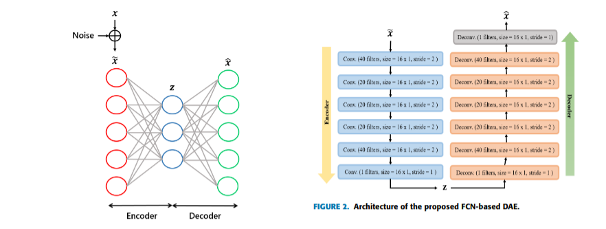
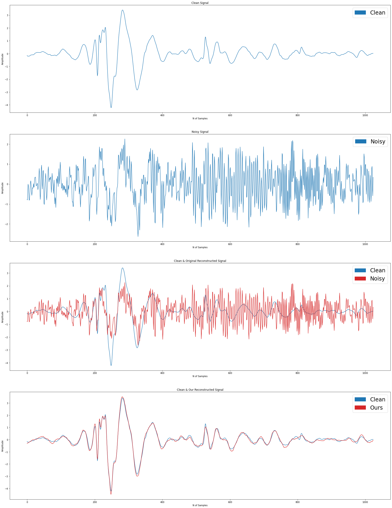

# fully convolutional autoencoder for PCG noise reduction

Cardiovascular diseases are the leading cause of death worldwide, claiming nearly 18 million lives each year, or one-third of global deaths. The graphic recording of heart sounds, called phonocardiogram (PCG) signals, can also be displayed on a digital computer and analyzed to provide more relevant information about the heart's condition, thus allowing for the assessment of certain vital heart functions. However, raw PCG recordings are not always directly usable due to ambient interference (e.g., speech, coughing, gastric noise, etc.). Therefore, it is necessary to denoise raw PCG signals before their interpretation.

The goals of this project are to:

- Reproduce the results of the fully convolutional autoencoder (FCN-DAE) method (*Noise Reduction in ECG Signals Using Fully
Convolutional Denoising Autoencoders*), see `/paper` folder, developed for denoising electrocardiogram (ECG) signals.

    

- Apply this method to a PCG database acquired with a single microphone held against the skin, in front of the ear, by a belt in the SiSEC2016 campaign (Signal Separation Evaluation Campaign 2016), see `/data` folder"

    

## Reports

See final reports into `/report` folder.

---
---
